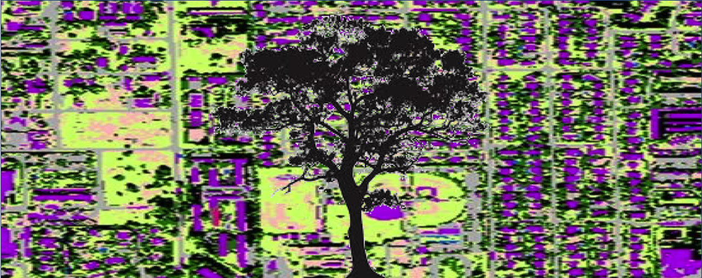
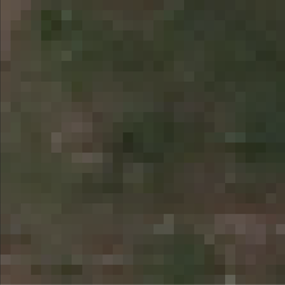
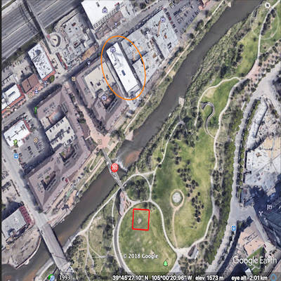
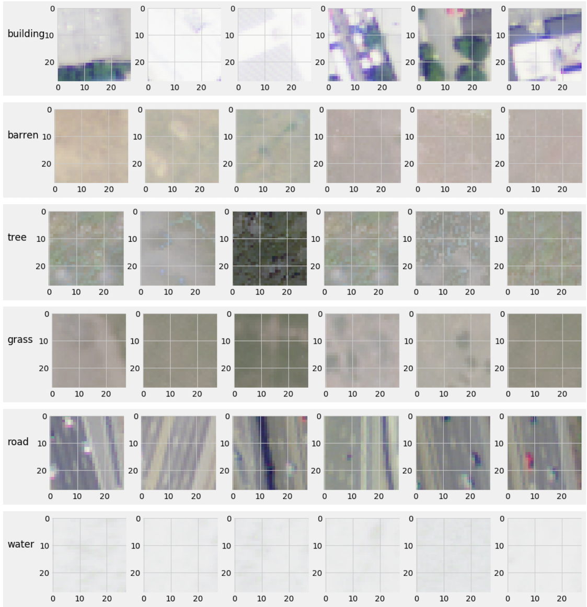
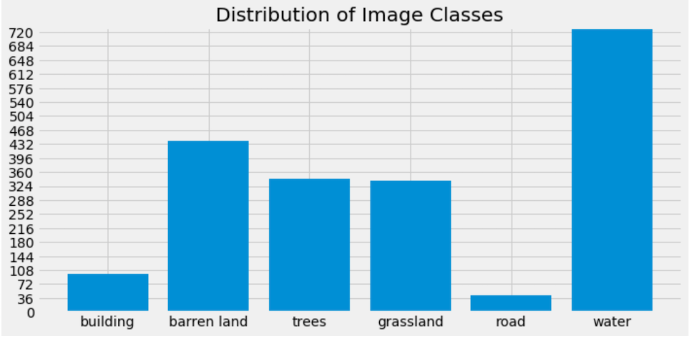
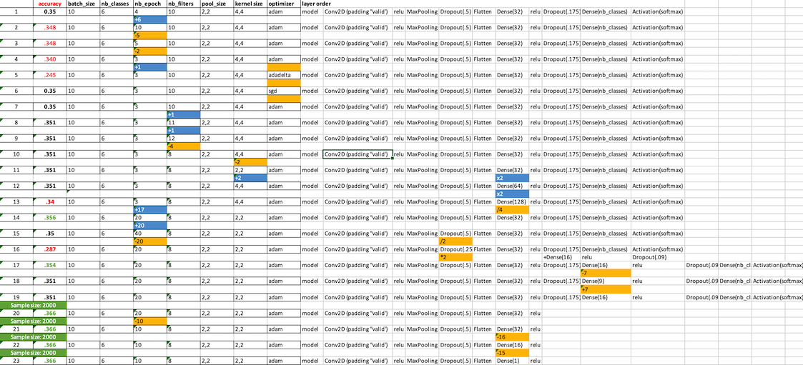

# Appleseed 2.0
***
## Introduction
***
In 2013, The City of Denver published an [assessment](https://www.denvergov.org/media/gis/DataCatalog/tree_canopy_assessment_2013/pdf/Tree_Canopy_Assessment_2013_Final_Report.pdf) of tree coverage throughout the metropolitan area in response to the air pollution, water, and energy demand issues arising from rapid urban growth. While the report enumerated the exact number of places available to plant a tree (8 million), it lacked a detailed visualization showing where these places are. This makes it more difficult for volunteer and environmental groups to take action without government involvement. In the spirit of more rapidly facilitating greener, cooler, healthier cities, this project seeks to harness the power of a convolutional neural network (CNN) to answer the question: **where can I plant some trees?**

## The Data
***
The 2013 report identified 7 different types of land cover, listed below. BSDV and grass are the obvious candidates for hosting trees, so my ultimate goal is to train a CNN to segment, and visualize the segmentation of, these types given aerial imagery.
1. Building
2. **Bare soil/dry vegetation (BSDV)**
3. Trees
4. **Grass**
5. Road
6. Water
7. Other impervious

 Before I went through the effort of hiring interns to help me capture and classify thousands of images, I figured I'd see what the world wide web had to offer. Luckily, a team of [scientists](http://bit.csc.lsu.edu/~saikat/publications/sigproc-sp.pdf) has already extracted and classified 405,000 images from the USDA's [National Agricultral Imagery Program (NAIP)](https://www.fsa.usda.gov/Internet/FSA_File/naip_2009_info_final.pdf). Images are *conveniently* classified into the following categories:
 1. Building
 2. **Barren land**
 3. Trees
 4. **Grassland**
 5. Road
 6. Water bodies

The data are also conveniently split into a four-fifths training set (324,000) and a one-fifth test set (81,000). Each image is a 28x28-pixel tile extracted from a series of about 1500 6000x7000-pixel photos taken of land throughout the state of California. These aerial photos were taken at a 1 meter ground sampling distance, meaning each pixel represents 1 meter in real space. Each image has 4 layers--red, green, blue, and near-infrared (NIR)


 


## EDA
***
The dataset came in the form of a single MATLAB file (.mat), which when loaded into a Python is simply a dictionary with a key for each subset (train x, train y, test x, test y), and a 28x28x4xN array as the value for each key. Using Pillow's `Image.fromarray`, I saved 2000 samples from each subset. Here's an example of what each class looks like:


Cool. You may notice these all have a white-ish filter on them. I attributed this to matplotlib trying to show me RGB AND NIR layers together. So when we see these images, the white layer seems to obscure the image, but I thought when the CNN read through the layers, the NIR imagery would just be additional data to help distinguish between classes. Either way, you can still pretty well identify which class each image belongs to. I also wanted to make sure I had enough images from each class to train on. 

It looks like the building and road classes are a little lacking compared to to others, but I figured I'd see how my model did first, then correct for undersampling if it seemed to be an issue. 

## CNN
I started simple:
```
Block 0:
Convolutional 2D(8 filters)
Relu activation

Block 1:
Convolutional 2D(8 filters)
Relu activation 
MaxPooling 2D(2x2)
Dropout(.5)
Flatten

Final Block:
Dense(32 neurons)
Relu activation
Dropout(.175)
Dense(6 neurons)
Softmax activation

Compiled with:
Loss: Categorical Crossentropy
Optimizer: Adam
Metrics: Accuracy
```

Then started the exhilarating process of tuning:

***Takeaways:***
- 
- Changing sample size had greatest effect on accuracy
- Accuracy doesn't seems to be affected by any one hyperparameter, except the optimizer


